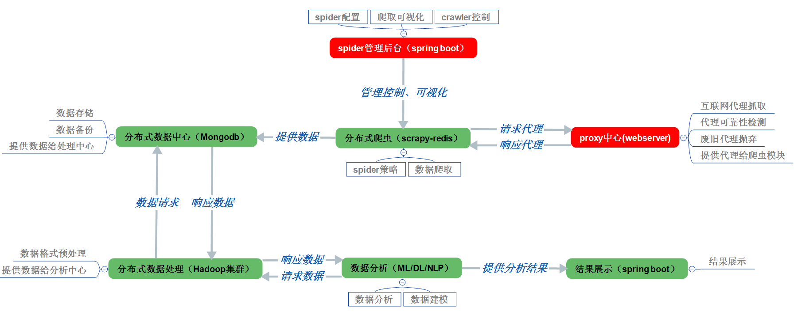

# 基于微博的数据挖掘与社交舆情分析

## This project consists of four parts:
```
1. Crawl weibo data, contain comment、userinfo etc...
2. Process the captured data to the format we want
3. Analyze the data in order to get social sentiment information
4. Show the final result on the website
```

## Testing environment
```
system: ubuntu-17.2.0
```

## Project catalog:
```
1.Docker: to create project by Docker
2.Run: the script to run and control the project
3.SourceProject: the crawler project
```

## Project architecture


## current progress:
```
---Initially completed weibo-comment spider
---Initially completed distributed spider base docker
```

## Join Us
```
===========================================================
now, the project has just begun, if you want to join us, 
please contact me by flow:
个人QQ:410282618
QQ群:414507076
Email:410282618@qq.com
---2017.11.11
===========================================================
```
