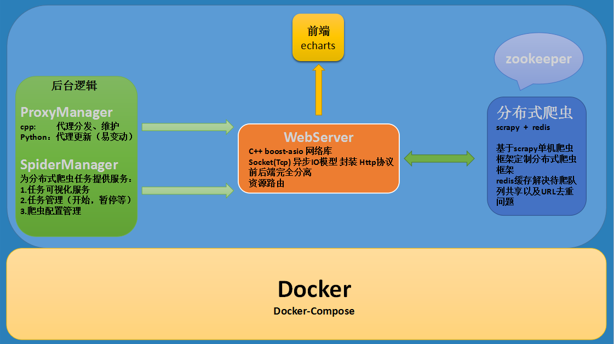

# 基于微博的数据挖掘与社交舆情分析

## This project consists of four parts:
```
1. Crawl weibo data, contain comment、userinfo etc...
2. Process the captured data to the format we want
3. Analyze the data in order to get social sentiment information
4. Show the final result on the website
```

## Testing environment
```
system: ubuntu-16.0
```

## Project catalog:
```
1.Run-Docker: 使用docker完成项目的部署，并开展任务
2.SourceProject: 项目源代码
3.Github-Info: github项目展示的资料
```

## Project architecture
> 

## current progress
> 

## Join Us
```
====================================================================================
now, the project has just begun, if you want to join us, please contact me by flow:

QQ-self:410282618
QQ-group:414507076
Email:410282618@qq.com

---2017.11.11
====================================================================================
```
